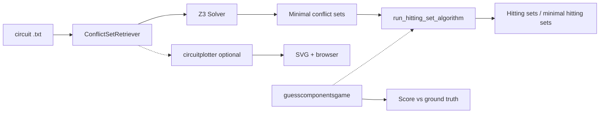

# Hitting Sets — Model-Based Circuit Diagnosis

A Python toolkit for **Knowledge-Based AI** coursework that combines **Boolean circuit models**, **SMT reasoning (Z3)**, and **hitting-set computation** to diagnose inconsistent observations. The pipeline derives **minimal conflict sets** from a declarative circuit description, then enumerates **hitting sets** and **minimal hitting sets** as candidate diagnoses.

---

## Table of contents

- [Overview](#overview)
- [Capabilities](#capabilities)
- [System requirements](#system-requirements)
- [Installation](#installation)
- [Quick start](#quick-start)
- [Configuration](#configuration)
- [Circuit file format](#circuit-file-format)
- [Project structure](#project-structure)
- [Architecture](#architecture)
- [Troubleshooting](#troubleshooting)
- [References](#references)

---

## Overview

Given a combinational logic circuit, primary input observations, and primary output observations, the system asks: *which gates might be faulty if the observations cannot all hold when gates behave correctly?*

1. **Conflict-set retrieval** — For each non-empty subset of gates, the tool assumes exactly those gates are healthy (others faulty) and checks consistency with the model and observations using Z3. Inconsistent assumptions yield **conflict sets**; these are reduced to **minimal conflict sets**.
2. **Hitting sets** — A **hitting set** for a family of sets intersects every set in the family. Minimal hitting sets correspond to compact candidate diagnoses in classical model-based diagnosis (MBD).
3. **Optional interactive mode** — A small CLI “game” lets you hypothesize conflict sets; the program compares your input to the ground truth and reports a similarity score.

The formal assignment specification is provided in `Assignment_2_KBAI.pdf` in this repository.

---

## Capabilities

| Area | Description |
|------|-------------|
| **Parsing & validation** | Loads structured circuit files; validates sections and per-gate wiring (`IN1` / `IN2` exactly once each). |
| **Logical encoding** | Builds Z3 constraints for gate types (AND, OR, XOR), fault flags, and observations. |
| **Conflict analysis** | Enumerates minimal conflict sets via satisfiability checks. |
| **Diagnosis enumeration** | Depth-first search with heuristics (small conflicts first, frequent components first) to list hitting sets and minimal hitting sets. |
| **Visualization** | Renders bundled example circuits with **SchemDraw** and opens the SVG in your default browser (where supported). |

---

## System requirements

- **Python** 3.9 or newer (3.10+ recommended).
- **pip** for dependency installation.
- A **default web browser** (used when circuit plotting is enabled) to view generated SVG diagrams.
- **Operating system**: Windows, macOS, or Linux. On some Linux distributions, the Z3 Python bindings may require additional system packages; if `import z3` fails after `pip install`, install your distribution’s Z3 development libraries and retry, or use a prebuilt wheel from PyPI if available for your platform.

Pinned versions are listed in `requirements.txt`.

---

## Installation

### 1. Clone or copy the repository

Obtain a local copy of the project root (the folder containing `main.py`, `requirements.txt`, and the `circuits/` directory).

### 2. Create a virtual environment (recommended)

```bash
python -m venv .venv
```

Activate it:

- **Windows (cmd):** `.venv\Scripts\activate.bat`
- **Windows (PowerShell):** `.venv\Scripts\Activate.ps1`
- **macOS / Linux:** `source .venv/bin/activate`

### 3. Install dependencies

From the project root:

```bash
pip install --upgrade pip
pip install -r requirements.txt
```

**Declared dependencies**

| Package | Role |
|---------|------|
| `z3-solver` | SMT solver used for consistency checking and conflict-set extraction. |
| `schemdraw` | Schematic generation for the bundled example circuits. |

---

## Quick start

Run the main entry point from the **project root** (so paths such as `circuits/circuit1.txt` resolve correctly):

```bash
python main.py
```

Typical console output includes:

- (If interactive mode is on) A diagram may open in the browser, then prompts for conflict sets.
- **Actual conflict sets** computed from the circuit file.
- **Hitting sets** and **minimal hitting sets** derived from those conflict sets.
- (If interactive mode is on) A **score** comparing your guessed conflict sets to the computed ones.

To analyze another bundled example, edit `main.py` and set `document` to one of `circuit1.txt` … `circuit7.txt` (see [Configuration](#configuration)).

---

## Configuration

Key settings in `main.py`:

| Setting | Purpose |
|---------|---------|
| `document` | Circuit filename (e.g. `"circuit1.txt"`). Resolved under `circuits/` via `ConflictSetRetriever`. |
| `game` | If `True`, runs the interactive conflict-set guessing flow, plots the circuit (when a plotter exists for that file), and prints a score. If `False`, only runs automated conflict-set retrieval and hitting-set computation. |

No separate `.env` or CLI arguments are required; adjust these variables for different scenarios.

---

## Circuit file format

Circuit descriptions are plain text with four structured blocks. Example structure:

```text
COMPONENTS:
ANDG(A1)
XORG(X2)
----------

BEHAVIOUR:
IN1(X2)=OUT(X1)
IN2(X2)=1
----------

OBSERVATIONS:
IN1(X1)=1
----------

OUT-OBSERVATIONS:
OUT(O1)=0
----------
```

**Rules (enforced by the retriever):**

- **COMPONENTS** — One gate per line: `ANDG(name)`, `ORG(name)`, or `XORG(name)`.
- **BEHAVIOUR** — Each gate must have exactly one `IN1(comp)=…` and one `IN2(comp)=…` line. Right-hand sides may be literals `0`/`1` or `OUT(other_gate)`.
- **OBSERVATIONS** — Primary inputs as `INx(Gate)=0|1` in file order (must align with internal indexing).
- **OUTOBSERVATIONS** — Observed outputs `OUT(Gate)=0|1`.

Invalid structure or wiring raises a clear exception during initialization.

---

## Project structure

```text
.
├── main.py                 # Entry point: orchestration, optional interactive mode
├── conflictsets.py         # Circuit parser, Z3 model, minimal conflict-set retrieval
├── hittingsets.py          # Hitting-set and minimal hitting-set enumeration
├── circuitplotter.py       # SchemDraw diagrams for circuit1–circuit7
├── guesscomponentsgame.py  # Interactive conflict-set input and scoring
├── requirements.txt        # Pinned Python dependencies
├── Assignment_2_KBAI.pdf   # Course assignment specification
└── circuits/
    ├── circuit1.txt
    ├── …
    └── circuit7.txt
```

Generated artifacts (when plotting runs) may include `.circuit.svg` in the working directory. You may add such files to `.gitignore` if you do not wish to track them.

---

## Architecture

End-to-end flow:



- **`ConflictSetRetriever`** reads the file, builds fault assumptions and observation constraints, and uses Z3 to collect minimal conflict sets.
- **`run_hitting_set_algorithm`** takes a list of conflict sets (each a list of component identifiers) and returns deduplicated hitting sets and minimal hitting sets.

---

## Troubleshooting

| Issue | Suggestion |
|-------|------------|
| `ModuleNotFoundError: No module named 'z3'` | Activate your virtual environment and run `pip install -r requirements.txt`. |
| Z3 install fails on Linux | Install system Z3/libz3 packages for your distribution, then reinstall `z3-solver`, or use a compatible Python wheel. |
| Plot does not appear | Ensure a default browser is configured; check that `plot_circuit` supports your chosen `document` name. |
| Wrong working directory | Always run `python main.py` from the directory that contains `main.py` and `circuits/`. |
| `circuit3` diagram path | One code path references `circuitssvg/circuit3.svg`; if the diagram does not open, use another circuit or align paths with your layout. |

---

## References

- **Reiter, R.** — Theory of diagnosis from first principles (conflict sets and hitting sets in MBD).
- **Course materials** — See `Assignment_2_KBAI.pdf` for learning outcomes and submission expectations.

---

## License and academic integrity

This repository is maintained for **educational use** as part of a Knowledge-Based AI assignment. If you reuse or adapt the code, comply with your institution’s policies on originality and attribution.

For questions about scope or grading, refer to the course instructor or the brief in `Assignment_2_KBAI.pdf`.
